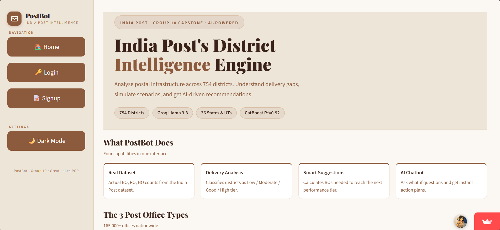

# 📮 PostBot — India Post District Intelligence Engine

> PGP in Data Science & GenAI | Great Lakes Institute | Group 10 | Batch 2025–26

## 🚀 Live Demo
👉 **Streamlit App:** https://postbot-india-post.streamlit.app

## 📊 Tableau Dashboards
| Dashboard | Link |
|-----------|------|
| 🗺️ National Overview | [View →](https://public.tableau.com/app/profile/vishwadesai.ds/viz/IndiaPostInfrastructure/NationalOverview) |
| 📍 District Intelligence | [View →](https://public.tableau.com/app/profile/vishwadesai.ds/viz/DistrictIntelligence/DistrictIntelligence) |

## 📌 Problem Statement
India Post operates 1,65,000+ offices across 754 districts with wildly 
varying delivery performance. Officers had no data-driven tool to understand 
why districts underperform or what to do about it.

## 🎯 Objective
Build an end-to-end AI decision support system that analyses postal 
infrastructure, predicts delivery performance, and recommends exact 
infrastructure changes needed.

## 🤖 Tech Stack
| Layer | Technology |
|-------|-----------|
| ML Model | CatBoost Regressor (R²=0.9243) |
| Clustering | K-Means (4 tiers, 720 districts) |
| AI Chatbot | Groq Llama 3.3 70B |
| Frontend | Streamlit |
| Visualization | Tableau Public |
| Language | Python 3.12 |

## 📊 Key Findings
- BO Ratio is #1 delivery predictor (Pearson r = +0.87)
- 1 in 4 Sub Post Offices has zero active delivery
- Only 19 districts are truly underperforming (< 70%)
- Districts above 85% BO ratio consistently achieve 95%+ delivery

## 🗂️ Project Structure
postbot-india-post/
├── app.py               ← Streamlit application
├── auth.py              ← Officer authentication
├── chatbot.py           ← Groq AI chatbot
├── model_utils.py       ← ML predictions & suggestions
├── notebooks/           ← Full analysis notebook
└── assets/              ← Dashboard screenshots

## 🔐 Login Credentials (Demo)
| Officer ID | Password | Circle |
|-----------|----------|--------|
| DEMO | demo123 | All India |
| IP2024KA001 | post@Karnataka | Karnataka |

## ⚙️ Run Locally
# 1. Clone
git clone https://github.com/vishwadesai/postbot-india-post.git
cd postbot-india-post

# 2. Install
pip install -r requirements.txt

# 3. Add Groq key
echo 'GROQ_API_KEY=gsk_your_key' > .env

# 4. Run
streamlit run app.py

## 📈 Model Performance
| Model | R² | RMSE |
|-------|----|------|
| Linear Regression | 0.71 | 0.091 |
| Random Forest | 0.89 | 0.056 |
| Extra Trees | 0.888 | 0.057 |
| **CatBoost** | **0.9243** | **0.047** |

## 👤 Author
**Vishwa Desai**
- Tableau: https://public.tableau.com/app/profile/vishwadesai.ds
- LinkedIn: your-linkedin-url

## 🏫 Program
Great Lakes Institute of Management  
PGP in Data Science & GenAI | Sep 2025 – Apr 2026  
Mentor: Mr. Aishwarya Sarda

## 📸 Screenshots

